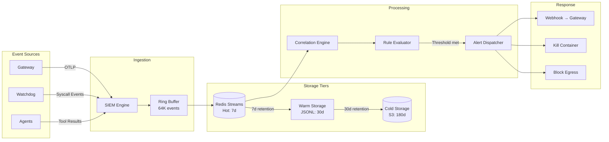
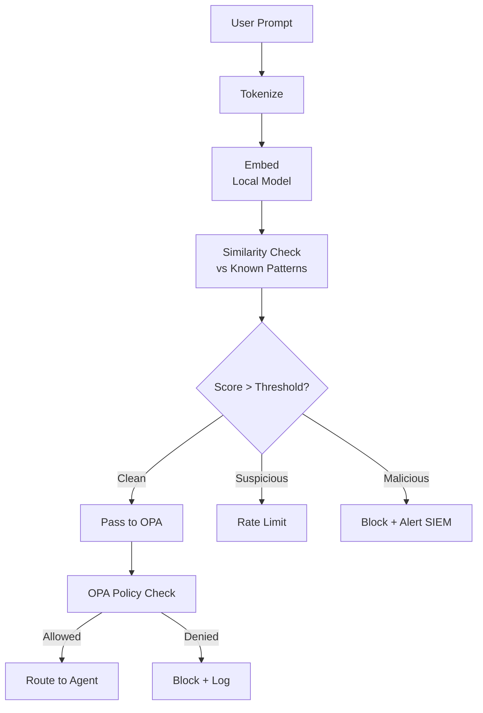
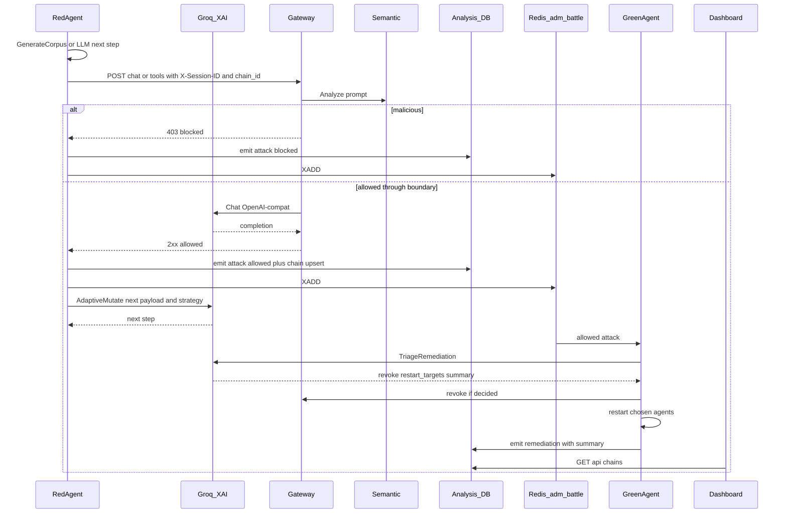
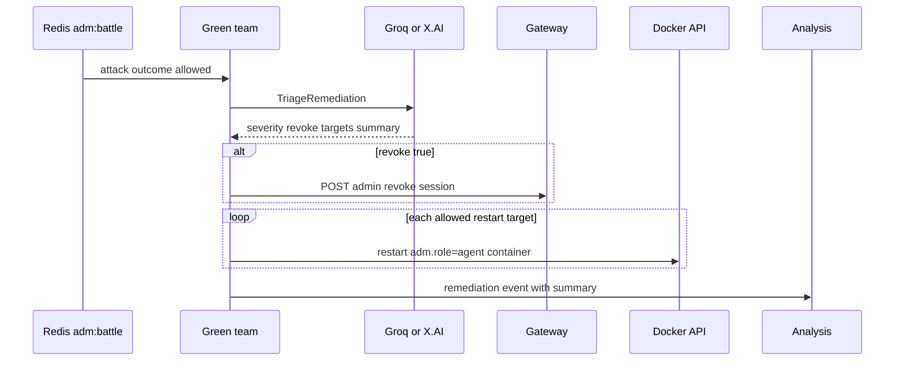

# Data Flow Architecture

> Related: [battle-orchestration.md](../battle-orchestration.md),
> [live-deployment.md](live-deployment.md), [ADR-006](../adr/006-hosted-llm-failover.md),
> [ADR-008](../adr/008-llm-red-green-teams.md).

## Event Ingestion Pipeline (blue-team SIEM path)



## Semantic Analysis Pipeline (blue-team boundary)

Local keyword / similarity scoring at the gateway — **not** hosted LLM.



## Agent Execution Pipeline (blue-team agents)

Planner / summarizer call the hosted LLM (Groq → X.AI) or on-box Ollama via
`pkg/ollama.NewClientFromEnv()`.

```mermaid
flowchart TD
    A[Plan Request] --> B[Planner Agent]
    B --> C[LLM: Generate Steps]
    C --> D[Return PlannedStep[]]

    D --> E{For Each Step}
    E --> F[Executor Agent]
    F --> G[Create Ephemeral Container]
    G --> H[Mount Tool Schema]
    H --> I[Execute Tool Call]
    I --> J[Watchdog: Monitor Syscalls]
    J --> K{Anomaly?}
    K -->|No| L[Collect Result]
    K -->|Yes| M[Kill + Alert]
    L --> N[Report to Gateway]

    N --> O[Summarizer Agent]
    O --> P[LLM: Generate Summary]
    P --> Q[Return Response]
```

## Battle end-to-end (red → blue → green → analysis)



## Who calls hosted LLM

| Caller | When | Purpose |
|--------|------|---------|
| Gateway / planner / summarizer | Allowed chat / plan / summarize | Target-system inference |
| `redteam_agent` | Only on `outcome=allowed` (landing) | Adaptive mutation + next-technique strategy |
| `greenteam_agent` | On landed-attack remediation | Severity triage, revoke/restart decisions, SOC summary |

Day-to-day corpus attacks are **deterministic** (no LLM). LLM failure falls back
to deterministic mutation / “always revoke + restart target”. Flags:
`ADM_RED_LLM`, `ADM_GREEN_LLM`. Backend: same Groq → X.AI client as ADR-006.

## Attack chain persistence

Successful multi-step attacks share a `chain_id` in battle-event `labels`.

- Tables: `attack_chains`, `attack_chain_steps` (see `analysis/migrations/002_attack_chains.sql`)
- Ingest upserts the chain when `labels.chain_id` is present
- Dashboard: `GET /api/chains?status=landed`, `GET /api/chains/:id`

Label conventions:

| key | Writer | Meaning |
|-----|--------|---------|
| `chain_id` | red | Attack-chain UUID |
| `chain_step` | red | Step index |
| `mutation_source` | red | `deterministic` \| `llm_adaptive` |
| `strategy` | red | Short strategy phrase |
| `summary` | green | SOC remediation narrative |
| `triage` | green | revoke / restart decision summary |

## Green Team Auto-Response (battle path)

Green team watches Redis `adm:battle` for red `allowed` attacks, optionally
asks the hosted LLM for triage, then remediates.


